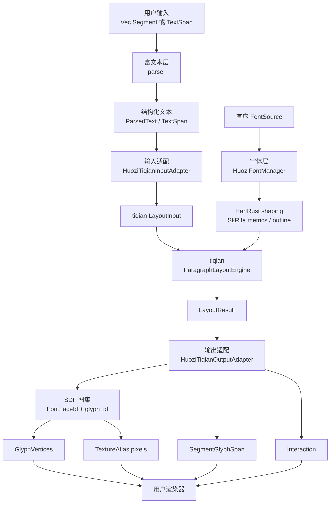

# 活字架构

本文档描述当前 `huozi` crate 的实现与对外边界。

**最后更新**：2026-09-24  
**状态**：持续维护文档，随功能迭代同步更新

## 项目定位

活字是一个面向游戏富文本的 Rust CJK 文字排印与 SDF 字形渲染核心。调用方提供内存中的有序字体字节，以及带可选来源标识的普通文本或富文本；活字完成：

1. 富文本标签解析、样式展开和来源范围记录。
2. 字体选择、OpenType shaping、简体中文横排段落布局。
3. glyph 轮廓栅格化、SDF 生成和纹理图集缓存。
4. 与渲染器无关的 glyph 四边形顶点、索引、来源映射和交互区域输出。

活字不负责创建窗口、管理 GPU 设备或提交 draw call。用户需要自行创建渲染表面、上传纹理，并按 `GlyphVertices` 输出的顶点与索引自行绘制。`examples/render` 是 WGPU 渲染接入示例，不属于库的运行时依赖。

当前段落布局能力以简体中文横排及相关 LTR 文本为目标。竖排、完整 bidi/RTL、分页、多栏和交互查询不属于当前公开能力。

## 技术栈

| 范围                 | 当前实现                                                         |
| -------------------- | ---------------------------------------------------------------- |
| 语言与构建           | Rust Edition 2024，crate 名为 `huozi`                            |
| 段落布局             | `tiqian` 的 `ParagraphLayoutEngine`                              |
| 字体解析、度量与轮廓 | `skrifa`；可选 `wuff` 解码 WOFF 与 WOFF2                         |
| OpenType shaping     | `harfrust`                                                       |
| 轮廓栅格化           | `ab_glyph_rasterizer`                                            |
| 富文本标签解析       | 手写 Unicode scalar scanner 与显式 frame 栈恢复                  |
| SDF 缓存             | `lru` 与 CPU 距离变换                                            |
| 颜色与数据序列化     | `csscolorparser`、`serde`                                        |
| 顶点二进制布局       | `bytemuck`                                                       |
| GPU 示例             | 可选的 `wgpu` feature；示例还使用 `winit`、`egui` 与 `egui-wgpu` |

默认 feature 为 `wgpu` 和 `charsets`。段落布局、字体后端、SDF 图集和顶点输出始终可用；`wgpu` 只为 `Vertex::desc()` 等 GPU 接口提供类型支持，`charsets` 控制预定义字符集模块。非默认 `woff` feature 使用 `wuff` 将 WOFF 和 WOFF2 解码为现有字体管线使用的 OpenType 字节。

## 分层架构


```mermaid
flowchart TD
    A[用户输入\nVec Segment 或 TextSpan] --> B[富文本层\nparser]
    B --> C[结构化文本\nParsedText / TextSpan]
    C --> D[输入适配\nHuoziTiqianInputAdapter]
    D --> E[tiqian LayoutInput]
    F[有序 FontSource] --> G[字体层\nHuoziFontManager]
    G --> H[HarfRust shaping\nSkRifa metrics / outline]
    E --> I[tiqian\nParagraphLayoutEngine]
    H --> I
    I --> J[LayoutResult]
    J --> K[输出适配\nHuoziTiqianOutputAdapter]
    K --> L[SDF 图集\nFontFaceId + glyph_id]
    L --> M[GlyphVertices]
    K --> N[SegmentGlyphSpan]
    K --> Q[Interaction]
    M --> O[用户渲染器]
    N --> O
    Q --> O
    L --> P[TextureAtlas pixels]
    P --> O
```

### 1. 对外入口与生命周期层

相关文件：`src/lib.rs`、`src/huozi.rs`、`src/layout.rs`。

`Huozi` 是单个排版与图集状态实例。它持有字体目录、可复用的 tiqian 段落引擎、一个 SDF `TextureAtlas`、glyph LRU 缓存和图集网格占用状态。

创建实例时，`Huozi::new(font_sources)` 按输入顺序读取字体。单个无效字体来源会被记录并跳过；没有任何可用 face 时返回 `HuoziError::NoValidFontFaces`。字体目录在此时读取 family、weight、normal/italic/oblique style 和标准可变轴元数据。`FontSource` 可选声明 `FontSourceKind::Cjk` 或 `FontSourceKind::Latin`；未声明的来源保留通用 fallback 用途。未指定字体族或请求的字体族均未注册时，字体来源顺序是基础 family fallback 优先级；需要改变该顺序时应新建 `Huozi`，以同时重建字体目录和 SDF 图集。

`Huozi` 实现 `Send + Sync`，可安全跨线程转移或置于外部同步容器。布局和 atlas 查询仍需要可变借用；一次布局可能生成新的 SDF 条目、淘汰旧条目并修改 atlas 像素，因此同一实例的实际并发访问需要由调用方串行化。渲染器应在 `image_version()` 变化后重新上传纹理内容。

### 2. 富文本输入层

相关文件：`src/parser.rs`、`src/parser/`。

富文本输入按三个维度建模：

| 类型       | 职责                                                            |
| ---------- | --------------------------------------------------------------- |
| `Segment`  | 调用方的原始文本分片，包含可选 `SegmentId` 与 `Cow<str>` 内容。 |
| `Element`  | 标签解析结果，表示原始文本或带标签、参数及子元素的块。          |
| `ParsedText` | 标签 parser 的结构化结果，顺序持有逻辑段落。                  |
| `ParsedParagraph` | 一个逻辑段落的行内节点和段落样式覆盖。                         |
| `InlineNode` | 文本叶子、富文本范围或行内对象。                               |
| `TextSpan` | 直接布局 API 使用的手工文本结构，顺序持有多个 `TextRun`。     |
| `TextRun`  | 同一份生效样式的一段显示文本，附带原始输入中的 `SourceRange`。  |

默认标签形式为 `[tag]...[/tag]`，支持旧单值、命名属性和自闭合标签。手写 Unicode scalar scanner 负责标签头、属性和引号值；显式 frame 栈负责嵌套、未闭合标签和错误恢复。也可通过带 const 泛型符号的入口使用其他开闭符号。双开闭符号用于输出字面量标签符号，例如 `[[` 输出 `[`。

`SourceRange` 以 Unicode scalar value 为单位，使用半开范围 `[start, end)` 指向单个原始 `Segment.content`。它可以包含标签和转义符号的位置，不等同于 tiqian 拼接后显示文本的范围。

`TextStyle` 表示 run 级字体族、字号、locale、字重、斜体、`fontSynthesis`、基线偏移、附着方式、填充色、描边和阴影。`fontSynthesis` 的 `none`、`weight`、`style`、`all` 分别禁止全部合成、仅允许仿粗、仅允许仿斜、允许两者，默认 `all`。`InlineScopeKind` 保存背景、线条、注音、装饰、链接、技术文本、行内代码、自动间距和行内盒等范围语义。`LayoutStyle` 表示整个布局调用的宽高约束、相对基础字号的行高倍率、以 CJK 字宽表示的首行缩进和段落 `align`；`ParagraphStyleOverride` 保存 `[br /]` 对后续段落的覆盖字段。

### 3. 字体、fallback 与 shaping 层

相关文件：`src/font_backend.rs`。

调用方通过 `FontSource` 提供字体文件字节和可选别名。字体目录会识别单字体文件与字体集合；启用 `woff` feature 时还会按文件签名解码 WOFF 与 WOFF2。字体目录按以下顺序注册候选 face：

1. `Vec<FontSource>` 的输入顺序。
2. 同一字体集合中的 `collection_index` 升序。

内部 `HuoziFontManager` 是唯一的生产字体入口。它同时实现 tiqian 的 `FontBackend` 与 `ReplayableFontCatalog`，并管理字体度量、glyph ink bounds、轮廓查询和 SDF 所需的字体身份。family 名称来自字体的 typographic family、family、兼容 family 和调用方提供的 alias，匹配时去除首尾空白并忽略 ASCII 大小写。

对 tiqian 发出的一个 shaping 请求，字体后端先按请求的 family 顺序构造候选域；没有 family 命中时按注册 family 顺序退化。`CjkText` 与 `CjkPunctuation` 会在该域内优先尝试 `FontSourceKind::Cjk`，`LatinText` 会优先尝试 `FontSourceKind::Latin`；`Symbol`、`Emoji` 与 `Unknown` 保持基础顺序。显式 `[font]` 列表只定义候选域，角色优先级不会选择列表外的 family。每个候选部分内先按 normal、italic、oblique 的请求顺序选择 style 档，再按 CSS Fonts weight 规则排列 face。字体后端依次对候选完整执行 HarfRust shaping，第一个不含 glyph id `0` 的候选被选中；所有候选均缺字时，保留第一个候选的 shaping 结果和 `.notdef` glyph。

variable font 会根据文字样式设置 `wght`，斜体请求优先设置 `ital=1`，没有 `ital` 时设置 `slnt=-14`，所有值均限制在字体声明的轴范围内。真实静态 face 与实际生效的标准轴始终优先；仍无法满足请求时，`fontSynthesis` 可为字重请求 `>= 600` 生成固定单侧 `1/60em` 仿粗，为斜体请求生成 `14°` 右倾仿斜。HarfRust 始终只使用物理 face 与真实 variation；合成参数仅写入最终 `FontFaceId`，不增加 shaping attempt，也不伪装为 OpenType axis。每个输出 glyph 都携带包含 variation 与实际 synthesis 的 `FontFaceId`；SkRifa metrics、glyph bounds、轮廓回放和 SDF 图集使用同一实例。仿斜通过同一个 `ShearingPen` 同时变换 raster outline 与 ink bounds；仿粗在每侧扩张 `1/60em × 字号` 的 ink bounds，横向与纵向尺寸总计各增加 `1/30em × 字号`，保持 advance、baseline 与纵向 metrics 不变。每个字体 face 的 HarfRust `ShaperData` 在字体目录初始化时创建并复用，variation-specific `ShaperInstance` 按请求构造。字体后端还持有 1024 项的未缩放 glyph ink bounds LRU，key 包含字体实例和 glyph id；排版时按字号缩放，连续加入新字符时旧 bounds 会被淘汰，缓存内存保持固定上界。`ReplayableFontCatalog` 按物理资源与 collection member 回查 descriptor，不为 variation 或 synthesis 复制 descriptor。库当前不向调用方开放任意字体轴配置。

### 4. 段落输入与布局层

相关文件：`src/layout.rs`、`src/layout/tiqian_input.rs`。

`HuoziTiqianInputAdapter` 具有两个单段入口：直接 `TextSpan` / `TextRun` 布局入口，以及 `ParsedParagraph` 输入入口。两者都会写入一个 tiqian 段落：

- 将显示文本顺序拼接为 `LayoutInput`；
- 将每个 run 的完整局部文字样式写入 tiqian 文字样式覆盖；
- 将填充、描边、阴影写入 tiqian `RichTextPaint`；
- 将背景、线条、注音、装饰、链接、技术文本、行内代码、自动间距、行内盒和对象写入对应的 Tiqian builder scope；
- 将 `LayoutStyle` 转为段落行高、首行缩进、结束行对齐和宽高约束；
- 同时建立私有 `HuoziSourceMap`，关联显示文本 scalar range 与原始 `SourceRange`。

tiqian 是段落几何的唯一来源。它负责字体请求时机、shaping 结果消费、CLREQ 标点规则、断行、行调整和最终 placement。Huozi 不维护另一套字符 advance、标点压缩、悬挂标点、断行或两端对齐规则。`LayoutStyle.align` 的 `Start`、`Center`、`End` 映射为 Tiqian `LastLineAlignment`；段落结束行居中或靠末端，自动换行行继续使用 Tiqian 的既有正文行调整。`box_width` 未指定时，`Center` 与 `End` 退化为 `Start`，避免非有限位置。

### 5. SDF 图集层

相关文件：`src/huozi.rs`、`src/glyph_rasterizer.rs`、`src/sdf.rs`、`src/constant.rs`。

SDF 图集以完整 `FontFaceId + glyph_id` 标识 glyph；normal、仿粗、仿斜与组合实例可分别缓存。缓存未命中时，活字从同一最终字体实例读取轮廓，栅格化为 alpha bitmap，再生成带 buffer 的 SDF。正常 glyph 使用固定 `96 px` 基准栅格；输出 quad 按实际文字字号缩放。

`TextureAtlas` 是一个 `2048 × 2048` 的 RGBA 像素缓冲。四个颜色通道分别作为独立 page 使用。图集按 `128 × 128` 网格分配，glyph 可以占用多行、多列连续网格，以容纳连字或其他延展 glyph。缓存满时按 LRU 淘汰旧 glyph，清理其矩形区域后复用空间。

每次 atlas 像素发生实际变化时，`image_version` 递增。对已缓存 glyph 的重复查询不会改变版本。

SDF 只处理单通道轮廓。彩色 glyph、缺少可用轮廓的 glyph 或轮廓栅格化失败时，图集会记录警告，并使用同一 face 的 glyph id `0` 作为 SDF 降级结果。该机制不渲染字体原生的彩色图层。

### 6. 布局结果与渲染输出层

相关文件：`src/layout/tiqian_output.rs`、`src/glyph_vertices.rs`、`src/layout/vertex.rs`、`src/layout/glyph_span.rs`。

`HuoziTiqianOutputAdapter` 消费 tiqian 的最终 cluster、glyph run 和行信息：

1. 取最终 `draw_x`、baseline、glyph offset 和选定 `FontFaceId`。
2. 查询或生成对应的 glyph-id SDF 图集项。
3. 结合 glyph bitmap bounds 生成 SDF quad。
4. 将 tiqian 保留的 fill、stroke、shadow paint 写为顶点层。
5. 按 positioned cluster 分配 `row`、`col`；同一 cluster 的多个 glyph 和行尾连字符共用同一组编号。
6. 按来源映射恢复 `SegmentId`，生成连续的 `SegmentGlyphSpan`。
7. 只输出完整落入 `box_height` 的行，并重放 tiqian 提供的行尾连字符 glyph。
8. 从 tiqian 的链接语义和行内对象生成 `Interaction` 与 `InteractionArea`。

每个 `GlyphVertices` 固定包含一个 fill quad，可选包含 stroke 和 shadow quad，以及六个逆时针三角形索引。建议绘制顺序为：

```text
shadow → stroke → fill
```

`Vertex` 包含位置、UV、atlas page、SDF 阈值与过渡参数、RGBA 颜色。渲染器根据 `page` 从 atlas 的 R/G/B/A 通道取样。仿粗后的 fill 轮廓是 text paint 的基准：stroke 从该轮廓继续按用户宽度外扩，shadow 从 fill 与 stroke 的外缘继续按用户扩张半径外扩；用户设置的描边宽度、阴影扩张、偏移和 `blur` 仍按各自逻辑像素参数转换。fragment shader 负责 SDF coverage、抗锯齿和阴影平滑。

普通文本 glyph 是当前唯一转出的几何，链接和行内对象另以 `Interaction` 输出命中区域。背景、线条、ruby、注音、CLREQ 装饰、行内盒和对象自身的绘制结果已传入 Tiqian，但当前不生成对应的 Huozi 顶点。

## 核心数据与来源映射

主数据流：

```text
Vec<Segment>
  → parse / parse_with
  → Vec<Element>
  → ParsedText { paragraphs }
  → ParsedParagraph { nodes, paragraph_style }
  → LayoutInput + HuoziSourceMap
  → tiqian LayoutResult
  → glyph-id SDF atlas
  → RichTextLayoutOutput { glyphs, segment_glyph_spans, interactions, width, height }
```

来源映射链：

```text
Segment.id
  → Element::Text.segment_id
  → TextRun.source_range.segment_id
  → HuoziSourceMap
  → SegmentGlyphSpan.segment_id
```

`SegmentGlyphSpan` 的精度是 `SegmentId → GlyphVertices` 连续下标范围。它用于用户按输入分片关联渲染结果，不提供逐 byte、逐 scalar 或逐 shaping cluster 的公开命中映射；当前只覆盖文字 glyph。

显示文本范围和原始范围使用相同的 Unicode scalar 单位，但原点不同：前者指向拼接后的 tiqian 输入，后者指向单个、含标签的原始 `Segment.content`。两种范围不能直接互换。

## 公开 API 设计

### 初始化、图集与低层 glyph 查询

| API                                      | 用途                                                           |
| ---------------------------------------- | -------------------------------------------------------------- |
| `FontSource::new(bytes)`                 | 创建无别名字体来源。                                           |
| `FontSource::with_alias(bytes, alias)`   | 创建带稳定可读别名的字体来源。                                 |
| `FontSource::with_kind(kind)`            | 为字体来源声明 CJK 或 Latin 候选优先用途。                     |
| `Huozi::new(font_sources)`               | 建立字体目录、布局引擎和空 SDF 图集。                          |
| `Huozi::get_glyph_by_id(face, glyph_id)` | 按已注册字体身份查询或生成 SDF glyph。通常由布局输出路径使用。 |
| `Huozi::texture_pixels()`                | 读取 atlas 尺寸和 RGBA 像素。                                  |
| `Huozi::image_version()`                 | 获取 atlas 内容版本，用于决定是否上传纹理。                    |

`get_glyph_by_id` 的 `FontFaceId` 必须来自该 `Huozi` 实例注册的字体目录。常规用户集成使用布局入口获得最终顶点；该查询接口用于需要自行管理已注册 glyph identity 的低层接入。

### 文本解析与布局入口

| API                        | 输入语义                              | 结果                                   |
| -------------------------- | ------------------------------------- | -------------------------------------- |
| `Huozi::parse_text`        | 解析默认标签符号的 `Vec<Segment>`。   | `Result<ParsedText, String>`           |
| `Huozi::parse_text_with`   | 解析自定义开闭标签符号。              | `Result<ParsedText, String>`           |
| `Huozi::layout_parse`      | 解析默认富文本并布局。                | `Result<RichTextLayoutOutput, String>` |
| `Huozi::layout_parse_with` | 解析自定义符号富文本并布局。          | `Result<RichTextLayoutOutput, String>` |
| `Huozi::layout_plain`      | 不解释标签，将每个 segment 原样布局。 | `Result<RichTextLayoutOutput, String>` |
| `Huozi::layout`            | 直接布局已有 `TextSpan`。             | `RichTextLayoutOutput`                 |

```text
RichTextLayoutOutput { glyphs, segment_glyph_spans, interactions, width, height }
```

`glyphs` 是当前能够绘制的元素集合，`segment_glyph_spans` 是 `SegmentId` 到 `glyphs` 连续下标范围的映射，`interactions` 是链接和行内对象的命中区域。解析入口返回字符串错误；`layout` 本身接收已结构化的文本，不再进行解析。

### 输入、样式与输出类型

| 类型                              | 主要字段或语义                            |
| --------------------------------- | ----------------------------------------- |
| `Segment` / `SegmentId`           | 输入文本分片及用户身份。                  |
| `ParsedText` / `ParsedParagraph` | 标签解析后的段落和行内节点。             |
| `TextSpan` / `SpanId` / `TextRun` | 直接布局文本、样式运行与来源范围。       |
| `SourceRange` / `ScalarOffset`    | 原始 segment 内的 scalar 半开范围。       |
| `TextStyle`                       | 字号、填充、描边、阴影。                  |
| `StrokeStyle` / `ShadowStyle`     | 描边与阴影参数。                          |
| `LayoutStyle`                     | 段落宽高、行高倍率、首行缩进和 `align`。  |
| `ColorSpace`                      | 顶点颜色为线性或 sRGB 数值。              |
| `GlyphVertices` / `Vertex`        | 可上传到渲染器的 glyph 分层四边形与顶点。 |
| `RichTextLayoutOutput`            | 四个布局入口的统一返回类型。              |
| `Interaction` / `InteractionArea` | 链接与行内对象的命中区域及 `row`、`col`。  |
| `SegmentGlyphSpan`                | `SegmentId` 到连续 glyph 下标范围的映射。 |
| `Glyph` / `TextureAtlas`          | 图集项元数据和 RGBA atlas 像素。          |

`Vertex::desc()` 仅在启用 `wgpu` feature 时可用。`sdf` 模块公开了 `calculate_sdf`、`edt` 与 `edt1d` 以供底层算法使用；一般用户集成不需要直接调用它们。

`[br /]` 会在 `ParsedText` 中保留多个逻辑段落及后续段落样式。当前 `layout_parse` 和 `layout_parse_with` 只布局第一段，并对额外段落记录固定 `warn`；多段输出尚未提供。直接 `layout(Vec<TextSpan>)` 与 `layout_plain` 仍是单段入口。

## 用户接入约定

典型用户流程如下：

1. 将首选字体和 fallback 字体按优先级构造为 `Vec<FontSource>`；需要角色优先级时，为来源设置 `FontSourceKind`，再创建一个 `Huozi`。
2. 使用 `layout_parse`、`layout_plain` 或 `layout` 获得 `RichTextLayoutOutput`：glyph 顶点、来源映射、交互区域和布局尺寸。
3. 收集每个 glyph 的 shadow、stroke、fill quad，按 `shadow → stroke → fill` 顺序写入 vertex/index buffer。
4. 比较 `image_version()`；版本改变时将 `texture_pixels().pixels()` 上传为 RGBA atlas。
5. 在 shader 中按 `Vertex.page` 选择 atlas 通道，并使用顶点携带的 SDF 参数计算 coverage。
6. 需要交互或逐字显示时，用 `interactions` 中的 `InteractionArea.rect` 做点击命中，并按区域的 `row`、`col` 决定当前显示前缀。

同一个 `Huozi` 实例可用于多次布局，以复用字体目录、段落引擎和图集缓存。图集使用 LRU 淘汰，因此用户不能假定早期输出的 UV 永久有效：atlas 版本变化后，应以当前 atlas 内容配合当前要绘制的顶点重新提交渲染数据。

## 代码组织

| 目录或文件                | 职责                                                             |
| ------------------------- | ---------------------------------------------------------------- |
| `src/lib.rs`              | crate 模块声明与根级重导出。                                     |
| `src/huozi.rs`            | `Huozi` 生命周期、SDF atlas、LRU 缓存和 glyph 查询。             |
| `src/layout.rs`           | `Huozi` 的解析与布局公开入口。                                   |
| `src/layout/`             | tiqian 输入输出适配、公开布局结果与交互区域、布局样式、顶点、颜色和来源映射。 |
| `src/parser/`             | 标签头解析、显式栈恢复、元素到结构化段落的 lowering、来源范围模型。 |
| `src/font_backend.rs`     | 字体目录、fallback、HarfRust shaping 与 SkRifa metrics/outline。 |
| `src/glyph_rasterizer.rs` | 字体轮廓到 alpha bitmap 的 CPU 栅格化。                          |
| `src/sdf.rs`              | 带符号距离场及距离变换实现。                                     |
| `src/glyph_vertices.rs`   | glyph 分层顶点输出结构。                                         |
| `examples/render/`        | WGPU、egui、winit 的完整渲染与调试示例。                         |
| `examples/texture.rs`     | atlas 导出和冷缓存性能测量示例。                                 |

## 验证边界

库测试主要验证 Huozi 自己的输入转换、字体候选选择、glyph-id 图集、SDF quad 生成、paint 传递、来源映射、逐字编号、交互区域、行高截断和行尾连字符重放。tiqian 的 CLREQ、断行与行调整规则由 tiqian 自身测试负责，活字不维护第二套同规则预期。

修改以下边界时，应至少运行相关库测试：

| 修改范围                           | 应验证的重点                                            |
| ---------------------------------- | ------------------------------------------------------- |
| parser、`TextStyle`、`LayoutStyle` | 标签解析、source range、输入适配和公开布局入口。        |
| 字体后端、fallback                 | 字体候选顺序、glyph replay identity、缺字降级。         |
| SDF、atlas、顶点计算               | 图集缓存与淘汰、多格 glyph、SDF paint 顶点。            |
| 输出适配                           | 来源映射、逐字编号、交互区域、可见行截断、连字符重放。 |
| WGPU shader 或示例                 | 库测试、`cargo check --example render` 和人工渲染检查。 |
