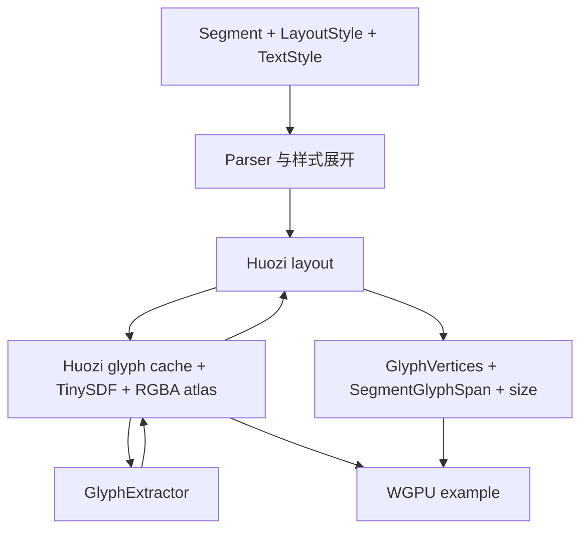

# Huozi 当前内部结构

- 调研日期：2026-07-26
- 对象：`huozi-rs` 0.17.1 工作区源码
- 性质：现状参考资料，不代表整合后的目标架构
- 关联：[整合 Roadmap](../roadmap.md) · [范围与 Shaping 边界纪要](../notes/2026-07-26-scope-and-shaping-boundaries.md)

## 1. 总览

Huozi 当前是单 crate 项目。默认功能将富文本解析、单字体字形提取、逐字符布局、SDF 图集和 WGPU 顶点输出连接在同一个运行时对象中。

```text
Segment
  -> parser::Element
  -> TextSpan / TextRun / SourceRange
  -> Huozi::layout
       -> TextRun.text.chars()
       -> Huozi::get_glyph(char)
       -> GlyphExtractor bitmap + metrics
       -> TinySDF
       -> RGBA atlas + LRU cache
       -> line wrap + quad geometry
  -> GlyphVertices / SegmentGlyphSpan / total size
  -> example renderer uploads atlas and vertex/index buffers
```

当前链路的主要特征：

- parser 保留 Segment 级身份和 UTF-8 byte range；
- `Huozi` 同时持有字体后端、SDF 工作区、图集和 glyph cache；
- layout 在排版过程中直接触发字形栅格化和图集写入；
- layout 的直接输出已经包含 SDF shader 与 WGPU 使用的数据；
- 当前没有 shaping run、shaping cluster、glyph-id 输入和多字体 fallback 模型。

## 2. Cargo 功能与源码模块

默认功能声明在 `Cargo.toml`：

```text
default = ab_glyph + wgpu + charsets + sdf + layout
```

| 功能 | 模块或依赖 | 当前作用 |
| --- | --- | --- |
| `ab_glyph` | `ab_glyph` | 默认字体读取、metrics 与灰度 bitmap 后端 |
| `fontdue` | `fontdue` | 可选字体提取后端 |
| `font_kit` | `font-kit`、`pathfinder_geometry` | 可选字体提取后端；当前仍从单个字体 bytes 构造，不负责系统字体发现；部分接口未完成 |
| `sdf` | `sdf` | `TinySDF`、字形图集与 cache 相关方法 |
| `layout` | `layout`、`glyph_vertices` | 文本布局、顶点与 Segment 映射 |
| `wgpu` | `wgpu` | 为 `Vertex` 提供 WGPU vertex buffer layout |
| `charsets` | `charsets` | 预置 ASCII、CJK 标点和简繁汉字字符表 |

`src/lib.rs` 暴露的模块如下：

```text
lib.rs
├─ charsets              feature = charsets
├─ constant
├─ font_extractor
├─ glyph_vertices        feature = layout
├─ huozi                 私有模块，经 crate 根重导出 Huozi / Glyph
├─ layout                feature = layout
├─ parser
└─ sdf                   feature = sdf
```

当前 feature 声明与代码依赖没有完全对齐：

- `layout` 没有声明依赖 `sdf`，但 `Huozi::layout` 直接调用仅在 `sdf` 下存在的 `get_glyph`；
- `Huozi` 重导出 `layout::ColorSpace`，未单独受 `layout` gate 保护；
- 三个字体后端都重导出同名 `GlyphExtractor`，没有显式互斥关系；
- 禁用全部字体后端后，`Huozi::new` 所需的具体 `GlyphExtractor` 不存在。

因此，默认 feature 组合是当前明确可见的完整路径；其他组合不能只根据 `Cargo.toml` 推断为可用。

## 3. 当前分层

Huozi 的源码可以按职责理解为五层，但这些层目前并非独立 crate，也没有严格的单向接口。



关键点是 `layout -> asset -> font`：layout 不只消费测量结果，还会产生 SDF 资产副作用。因此当前不能把 `layout` 当作纯排版层。

## 4. 输入与富文本解析层

### 4.1 输入类型

`src/parser/segment.rs` 定义：

```text
Segment
  id: Option<SegmentId>
  content: Cow<str>

SegmentId
  Tag(String)
  Lite(u32)
```

`Segment` 是 parser 和 `layout_parse` / `layout_plain` 的源文本输入。`SegmentId` 用于把部分最终绘制范围关联回调用者定义的段；匿名 Segment 不产生 `SegmentGlyphSpan`。

布局配置分为：

```text
LayoutStyle
  direction
  box_width
  box_height
  glyph_grid_size

TextStyle
  font_size
  fill_color
  line_height
  indent
  stroke
  shadow
```

当前 `LayoutStyle` 中实际被 layout 读取的是 `box_width` 和 `box_height`。`direction` 与 `glyph_grid_size` 尚未进入布局计算。

### 4.2 `Segment -> Element`

`src/parser/parse_elements.rs` 使用 `nom` 和 `LocatedSpan` 解析标签：

```text
parse(Segment) / parse_with<OPEN, CLOSE>(Segment)
  -> Result<Vec<Element>, String>
```

`Element` 分为：

```text
Text
  start / end
  content
  segment_id

Block
  start / end
  inner
  tag
  value
```

传递的信息：

| 输入 | 输出 |
| --- | --- |
| `Segment.content` | 解义后的纯文本或嵌套标签树 |
| `Segment.id` | 复制到 `Element::Text.segment_id` |
| `LocatedSpan.location_offset()` | 原 Segment 中的 UTF-8 byte offset |
| 自定义 OPEN/CLOSE | 标签语法边界 |

`[[` 和 `]]` 会分别显示为单个方括号，但 `start/end` 仍指向原始输入范围。

解析错误被格式化为 `String`。不完整输入分支被视为不可达。

### 4.3 `Element -> TextSpan / TextRun`

`src/parser/elements_to_spans.rs` 的 `to_spans` 使用显式栈展开嵌套标签：

```text
Vec<Element> + initial TextStyle + optional style prefabs
  -> Result<Vec<TextSpan>, String>
```

输出类型：

```text
TextSpan
  runs: Vec<TextRun>
  span_id: Option<SpanId>

TextRun
  text: String
  style: TextStyle
  source_range: SourceRange

SourceRange
  segment_id: Option<SegmentId>
  start / end: UTF-8 byte offsets
```

解析层传给 layout 的信息包括：

- 展开后的文本；
- 每个 run 的字号、行高、缩进、颜色、描边和阴影；
- 原 Segment 身份；
- 原 Segment 内的 UTF-8 byte range；
- `TextSpan` 分组。

当前 `SourceRange` 是 `TextRun` 级范围，不能表达 source byte 到单个字符、cluster 或 glyph 的映射。`span_id` 当前统一生成 `SpanId::Lite(0)`，不是唯一身份。

## 5. 字体提取层

### 5.1 共用接口

`src/font_extractor/common.rs` 定义 `GlyphExtractorTrait`：

```text
new(font_data, font_size) -> Self
set_font_size(font_size)
exist(char) -> bool
get_glyph_metrics(char) -> GlyphMetrics
font_metrics() -> FontHMetrics
get_bitmap_and_metrics(char) -> (grayscale bitmap, GlyphMetrics)
```

`GlyphMetrics` 输出：

- bitmap width / height；
- horizontal / vertical advance；
- x/y bounds；
- 可选 x/y scale。

`FontHMetrics` 输出：

- ascent；
- descent；
- line gap；
- line height；
- content height。

接口的基本单位是 `char`。它不接收 glyph id、script、language、direction、OpenType features 或 variation axes，也不输出 shaping cluster 和 glyph placement。

### 5.2 后端

| 后端 | 输入 | 输出 | 当前完成度 |
| --- | --- | --- | --- |
| `ab_glyph` | 单字体 bytes、字号、`char` | metrics、outline coverage bitmap | 默认路径，trait 方法均已实现 |
| `fontdue` | 单字体 bytes、字号、`char` | metrics、raster bitmap | trait 方法均已实现 |
| `font_kit` | 单字体 bytes、字号、`char` | font metrics、raster bitmap | `get_glyph_metrics` 为 `todo!()`；当前不执行系统字体发现或选择 |

三个后端的构造失败主要通过 `unwrap` / `expect` 处理。trait 本身没有结构化错误或 capability issue。

## 6. 字形资产、SDF 与图集层

### 6.1 `Huozi` 持有的状态

`src/huozi.rs` 中：

```text
Huozi
  extractor: GlyphExtractor
  tiny_sdf: TinySDF
  image: RgbaImage
  cache: LruCache<char, Glyph>
  next_grid_index
  image_version
```

`Huozi::new(font_data)`：

1. 以固定 `FONT_SIZE` 建立单字体 extractor；
2. 建立固定尺寸 RGBA atlas；
3. 建立 `TinySDF` 工作区；
4. 建立最多 1024 个条目的 LRU cache。

当前 atlas 使用 `2048 × 2048` 图像、`128 × 128` 网格和 RGBA 四个通道。`Glyph.page` 表示通道索引，不是 texture array layer。

当前没有 texture page/layer 扩展：`Glyph.page` 必须落在 RGBA 的 `0..3` 通道内。cache 容量按四个通道计算，但代码没有为通道范围之外的 page 提供额外存储或安全处理。

### 6.2 `get_glyph(char)`

输入：单个 Unicode `char`。

输出：缓存中的 `Glyph` 引用：

```text
Glyph
  ch
  metrics
  page / index / grid_count
  u_min / u_max / v_min / v_max
```

cache miss 路径：

```text
char
  -> extractor.exist
  -> extractor.get_bitmap_and_metrics
  -> TinySDF.calculate
  -> atlas grid/channel allocation
  -> write RgbaImage
  -> increment image_version
  -> return Glyph
```

缺字只记录 warning，随后继续使用当前字体后端。当前没有 fallback 候选和具名降级结果。

`cache` 的 key 只有 `char`，不含 font identity、glyph id、字号、variation 或 raster 参数。

`Huozi::preload(charset)` 是独立的资产预热入口。它在布局前逐 `char` 调用 `get_glyph`，最多处理 4096 个输入字符，并修改同一份 cache 和 atlas，但不产生布局结果。

### 6.3 `TinySDF`

`src/sdf.rs` 输入灰度 bitmap、尺寸和 grid count，经过内外距离变换后输出单通道 SDF bitmap。它不理解 source text、字体、glyph id 或布局位置。

## 7. 布局层

### 7.1 公共入口

`src/layout.rs` 在 `Huozi` 上提供：

| API | 输入 | 输出 |
| --- | --- | --- |
| `parse_text` | Segments、初始样式、prefabs | `Result<Vec<TextSpan>, String>` |
| `parse_text_with` | 同上及自定义标签符号 | 同上 |
| `layout_parse` | Segments、layout/text style、color space、prefabs | 布局结果 tuple |
| `layout_parse_with` | 同上及自定义标签符号 | 布局结果 tuple |
| `layout_plain` | Segments、layout/text style、color space | 布局结果 tuple |
| `layout` | `Vec<TextSpan>`、layout style、color space | 无错误返回的布局结果 tuple |

布局结果 tuple：

```text
(
  Vec<GlyphVertices>,
  Vec<SegmentGlyphSpan>,
  total_width: u32,
  total_height: u32,
)
```

`layout_parse` 的 `Result` 主要传播 parser 字符串错误。字体加载、缺字、SDF、图集和 layout 本身没有统一错误输出。

### 7.2 实际循环

```text
for TextSpan
  for TextRun
    for char in TextRun.text.chars()
      glyph = Huozi::get_glyph(char)
      metrics = glyph.metrics
      handle CR/LF or width overflow
      compute SDF quad geometry
      emit GlyphVertices
```

每个字符的输入信息：

- `TextRun.style`；
- 当前 x/y、row/column；
- `LayoutStyle.box_width/box_height`；
- `Glyph.metrics`；
- `Glyph` 的 atlas UV/page；
- `ColorSpace`。

输出过程：

1. `\n` / `\r` 不生成 `GlyphVertices`，但当前顺序仍先调用 `get_glyph`；首次出现时会触发字体查询、SDF 计算和 atlas 写入，然后才执行换行；
2. `current_x + h_advance` 达到盒宽时换行；
3. 达到高度限制后丢弃余下文本；
4. 用 metrics、固定 grid 常量和字号计算 quad；
5. 为 fill 生成四个顶点；
6. 可选生成 stroke 和 shadow 四边形；
7. 更新当前 pen 和总尺寸。

`—`、`―`、`⸺`、`–`、`⸻` 在 layout 中有硬编码的 advance 和水平缩放修正。这些判断没有命名策略或结构化 decision。

### 7.3 输出类型

`GlyphVertices`：

```text
shadow / stroke / fill: Vec<Vertex>
indices
row / col
x / y / width / height
scale_ratio
```

`Vertex` 包含：

- position；
- texture coordinates；
- atlas channel `page`；
- SDF `buffer` / `fill_buffer` / `gamma`；
- color。

因此该输出同时携带布局位置、字形资产定位和当前 shader 参数。

`SegmentGlyphSpan`：

```text
segment_id
Range<GlyphVertices index>
```

它只为 `segment_id = Some(...)` 的 run 序列提供到已生成 glyph quad 的粗粒度映射，不提供 source byte、grapheme、shaping cluster 或 glyph id 映射。匿名 Segment 没有对应项；相邻输入段如果复用同一个 `SegmentId`，会被合并为同一范围，不能据此恢复原 Segment 边界。

## 8. 渲染消费层

`examples/render/main.rs` 展示当前 WGPU 消费方式：

```text
Huozi::layout_parse
  -> Vec<GlyphVertices>
  -> 合并所有 shadow 顶点
  -> 合并所有 stroke 顶点
  -> 合并所有 fill 顶点
  -> 创建 WGPU vertex/index buffers

Huozi::texture_image
  -> 上传完整 RgbaImage 到 Rgba8Unorm texture

shader
  -> 以 Vertex.page 选择 RGBA channel
  -> 使用 SDF buffer/gamma/color 计算片元 alpha
```

示例每次成功 layout 后上传完整 atlas，没有根据 `image_version` 跳过未变化上传。渲染阶段不再测量或断行，因为 layout 已直接生成最终 quad。

## 9. 层间接口汇总

| 上游 | 下游 | 传递的信息 | 下游输出 |
| --- | --- | --- | --- |
| 调用者 | parser | Segment id、源文本、标签符号 | `Element` 树、UTF-8 byte offsets |
| parser | style expansion | Element、初始样式、prefabs | `TextSpan/TextRun`、样式、SourceRange |
| layout / preload | glyph asset | 单个 `char` | `GlyphMetrics`、atlas UV/page；同时更新 atlas |
| font backend | glyph asset | 单字体 bytes、字号、`char` | 灰度 bitmap、glyph/font metrics |
| glyph asset | SDF | bitmap、尺寸、grid count | SDF bitmap |
| layout | API caller | TextRuns、盒约束、颜色空间 | glyph quads、Segment glyph ranges、总尺寸 |
| layout + atlas | renderer | Vertex、indices、RGBA atlas | GPU buffers、texture、draw calls |

## 10. 当前耦合与明确缺口

### 当前耦合

- `Huozi` 同时负责字体、cache、SDF、atlas 和 layout；
- layout 调用 `get_glyph`，因此排版有资产生成副作用；
- parser 的 `TextStyle` 同时包含排版属性与 renderer 属性；
- `GlyphVertices` 已绑定 atlas 和 SDF shader 参数；
- layout 直接读取 `FONT_SIZE`、`GRID_SIZE`、`ASCENT` 等全局常量。

### 明确缺口

- 没有 production shaping 数据路径；
- 没有 shaping run、cluster、glyph id、offset 和 kerning；
- 没有多字体管理与 fallback；
- 没有 Unicode 断行、CJK 禁则、标点空间和 justification 模型；
- 没有独立 line box、baseline、layout decision 和可重放 glyph placement；
- source mapping 未连接到单个 cluster/glyph；匿名 Segment 不生成映射，相邻重复 ID 也不保留原段边界；
- `LayoutDirection::Vertical` 和 `glyph_grid_size` 当前未生效；
- `font_kit` 的 glyph metrics 接口未完成；
- feature 依赖关系与实际代码路径不完全一致。

## 11. 典型调用链

```text
example State::render_huozi_text
  -> Huozi::new(font_data)
       -> GlyphExtractor::new
       -> TinySDF::new
       -> RGBA atlas + LRU cache
  -> Huozi::layout_parse
       -> Huozi::parse_text
            -> parser::parse
            -> to_spans
       -> Huozi::layout
            -> TextRun.text.chars
            -> Huozi::get_glyph
                 -> extractor.get_bitmap_and_metrics
                 -> TinySDF.calculate
                 -> atlas write
            -> GlyphVertices
  -> merge shadow/stroke/fill vertices
  -> create WGPU buffers
  -> upload Huozi::texture_image
  -> draw_indexed
```

这条调用链既是当前可运行示例，也是后续分析 Huozi 与独立排版核心之间边界时的事实基线。
