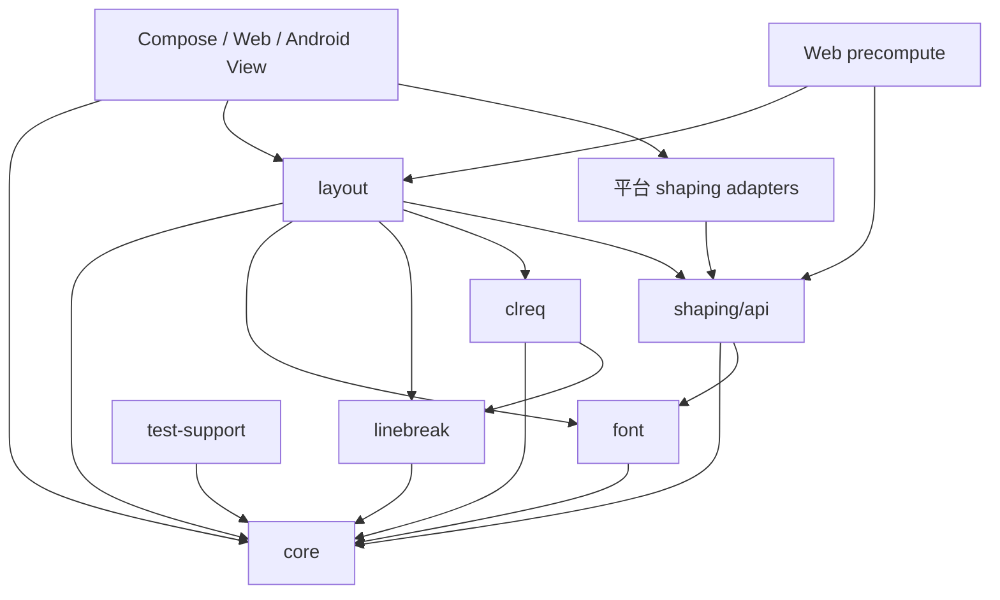

# Tiqian 当前内部结构

- 调研日期：2026-07-26
- 对象：`tiqian` Kotlin Multiplatform 工作区源码
- 性质：现状参考资料，不代表 `tiqian-rs` 的目标接口或 crate 结构
- 关联：[整合 Roadmap](../roadmap.md) · [范围与 Shaping 边界纪要](../notes/2026-07-26-scope-and-shaping-boundaries.md)

## 1. 总览

Tiqian 是 Kotlin Multiplatform 多模块项目。其平台中立核心定义文本、字体策略、断行、CLREQ 规则和最终布局结果；平台 adapter 提供字体 metrics 与 shaping 证据；Compose、Android、Web 和 Node 前端负责宿主输入转换、adapter 注入与结果重放。

```text
宿主文本 / AnnotatedString / DOM
  -> frontend lowering
  -> LayoutInput
  -> font role + fallback decision
  -> platform TextShaper + FontMetricsResolver
  -> linebreak opportunities + CLREQ profile
  -> paragraph layout / repair / adjustment
  -> LayoutResult + LayoutDebugInfo
  -> Compose glyph replay / DOM geometry replay
```

`ExplainableStubParagraphLayoutEngine` 保留历史名称。默认构造可使用 deterministic stub，但 Compose、Web 与 Node 主路径会注入真实平台 shaper 和 metrics resolver。

## 2. Gradle 模块与平台目标

`settings.gradle.kts` 包含：

```text
核心
  :core
  :font
  :linebreak
  :clreq
  :layout

Shaping
  :shaping:api
  :shaping:jvm
  :shaping:skia
  :shaping:android-adapter
  :shaping:web-adapter

前端
  :frontend:compose
  :frontend:web
  :frontend:web-precompute
  :frontend:android-view

辅助
  :test-support
  :demo
  :demo:android
```

主要 target：

| 模块 | JVM | Android | Browser JS | Node JS |
| --- | ---: | ---: | ---: | ---: |
| `core`、`font`、`linebreak`、`clreq`、`layout`、`shaping:api` | ✓ | ✓ | ✓ | — |
| `shaping:jvm`、`shaping:skia` | ✓ | — | — | — |
| `shaping:android-adapter` | — | ✓ | — | — |
| `shaping:web-adapter`、`frontend:web` | — | — | ✓ | — |
| `frontend:web-precompute` | — | — | — | ✓ |
| `frontend:compose`、`demo` | ✓ | ✓ | — | — |
| `test-support` | ✓ | — | — | — |

Android KMP 核心和 Compose 当前以 API 31 为最低目标。`frontend/android-view` 目前只有接口和 layout adapter，不是完整 Android View renderer。

核心模块只显式配置 Browser JS target。`frontend:web-precompute` 通过自身的 Node JS target 编译并链接这些核心源码；这不表示每个核心模块都单独声明了 Node target。`shaping:android-adapter` 则是独立的 Android library，不是与 `core/layout` 相同形态的 Android KMP target，由 Compose 的 `androidMain` 选择并注入。

## 3. 模块依赖与分层



图中箭头表示“依赖者 → 被依赖者”：

- `core` 不依赖其他 Tiqian 模块；
- `layout` 依赖 `core/font/shaping-api/linebreak/clreq`；
- `layout` 不依赖具体平台 shaper；
- frontend 选择平台 adapter，并注入 layout engine；
- renderer 消费 `LayoutResult`，不重新决定断行和标点空间。

## 4. `core`：平台中立输入模型

### 4.1 文本与样式

`core/.../TextModel.kt` 定义：

```text
TiqianTextContent
  text: String
  spans: List<TextSpan>
  sourceBoundaries: Set<Int>

TextSpan
  range: TextRange
  style: TextStyle

TextStyle
  fontFamilies
  fontSize
  locale
  fontWeight
  italic
  baselineShift
```

`TextRange` 使用 Kotlin `String` 的 UTF-16 offset。`sourceBoundaries` 强制建立 cluster 边界，供仅影响绘制或语义的链接、颜色和下划线获得精确几何。

### 4.2 段落和约束

```text
ParagraphStyle
  lastLineAlignment
  writingMode
  lineHeight
  firstLineIndent / blockIndent
  firstLineIndentPolicy
  lineLengthGrid
  rubyLineHeightMode
  emphasisDotGapEm

LayoutConstraints
  maxWidth / maxHeight / maxLines 等
```

`WritingMode.VerticalRl` 是模型扩展点，当前实现范围仍是横排。

### 4.3 行内语义

| 输入类型 | 传递的信息 | 是否影响布局 |
| --- | --- | --- |
| `DecorationSpan` | source range、着重号/示亡号/专名号/书名号 | 通常是后处理绘制几何；`Mourning` 例外地形成不可拆范围；行间标记可触发行距下限 |
| `RubySpan` | base range、注文、字体族、拼音/注音类型 | 是；影响断行和行高 |
| `InlineBoxSpan` | range、inline-start/end edge | 是；加入行内 advance |
| `InlineObjectSpan` | U+FFFC range、advance/ascent/descent | 是；不经过字体 shaping |
| `ColorSpan` | `start/end` UTF-16 offsets、ARGB | 否；只用于重放 |
| `RichTextSpan` | 背景、下划线、删除线、链接、inline code | 通常不影响断行；复用布局几何 |

### 4.4 统一输入

```text
LayoutInput
  content: TiqianTextContent
  textStyle
  paragraphStyle
  constraints
  profileId
  decorations
  rubySpans
  inlineBoxes
  inlineObjects
```

这是 `ParagraphLayoutEngine.layout` 的平台中立入口。

## 5. `core`：平台中立输出模型

`core/.../LayoutModel.kt` 定义：

### 5.1 `Cluster`

```text
range / source text / display text
fontKey
final layout advance
baselineShift
leadingLayoutAdvance
glyphInlineShift
```

`displayText` 可以因 CLREQ 推荐码点而不同于 source text，`range` 仍指向原 source。layout 可在字体证据不足时回滚 display substitution。

### 5.2 `Glyph` 与 `GlyphRun`

```text
Glyph
  id
  clusterRange
  shaping-time advance
  x / y origin
  optional renderFontKey
  optional ink bounds
  optional halt advance / placement

GlyphRun
  source range
  fontKey
  glyphs
  shaping-time advance
  OpenType features
```

重要区分：

- `Glyph.advance/x/y` 保存 shaper 的结果；
- 自动间距、标点 glue、justification 等 layout 空间保存在 `Cluster.advance`；
- renderer 以最终 cluster pen 加 glyph origin 绘制，不把 layout 空间折回 shaping placement。

### 5.3 `LineBox`

输出：

- source range 和 cluster index range；
- baseline/top/bottom；
- natural/adjusted/visual width；
- indent；
- end reason；
- hanging punctuation/hyphen advance；
- line debug。

### 5.4 `LayoutResult`

```text
LayoutResult
  input
  size
  clusters
  glyphRuns
  lines
  debug: LayoutDebugInfo
```

`LayoutQueries.kt` 在同一结果上提供 positioned clusters、ink bounds、offset/position 命中、cursor rect、range boxes 和 rich-text segment geometry。前端不需要重算 line membership 或 glyph 起点。

## 6. `font`：字体角色、fallback 与 metrics

### 6.1 字体角色分类

```text
FontRoleClassifier.classify(text, range, context)
  -> FontRole
```

当前 `FontRole`：

- `CjkText`；
- `CjkPunctuation`；
- `LatinText`；
- `Symbol`；
- `Emoji`；
- `Unknown`。

`CjkFontRoleClassifier` 根据 code point 和局部上下文分类。`FontRole.usesLatinFace()` 统一约束 shaping、metrics 和 renderer 的 Latin/CJK face 选择。

### 6.2 fallback 接口

```text
FontRequest
  preferredFamilies
  locale
  role

FallbackResolver.resolve(text, range, request)
  -> FontDecision

FontDecision
  range
  FontCandidate(key, family, role)
  role
  reason
```

默认 `PreferCjkForAmbiguousPunctuationResolver` 按角色选择具名 candidate，但本身不检查真实字体覆盖。平台 shaping 发现 missing glyph 后可向 layout 返回证据。

### 6.3 metrics 接口

```text
FontMetricsResolver.resolve(FontMetricsRequest)
  -> RawFontMetrics

FontMetricsNormalizer.normalize(FontMetricsNormalizationInput)
  -> LayoutFontMetrics
```

传递的信息包括：

- 字体 candidate 和 style；
- raw ascent/descent/leading；
- 可选 OpenType typo ascent/descent；
- role-aware baseline 和 metric box；
- 归一化后的 ascent/descent/baseline offset；
- 具名 metrics 来源和理由。

`ScriptAwareFontMetricsNormalizer` 对 CJK 优先使用 ideographic/typo box，对 Latin 保留 Roman baseline 模型。

## 7. `shaping/api` 与平台 adapter

### 7.1 公共接口

```text
ShapingInput
  full source text
  source range
  TextStyle
  FontDecision
  displayText

TextShaper.shape(ShapingInput)
  -> ShapingResult

ShapingResult
  clusters
  glyphRuns
  shaping decisions
```

adapter 的输入中，font decision 和 display substitution 已由上游决定。adapter 的职责是返回 glyph、advance、origin、ink bounds、字体身份和 capability issue，不决定 CLREQ 标点空间、禁则和 justification。

### 7.2 adapter 输出差异

| Adapter | 主要平台能力 | 输出证据 | 已知限制 |
| --- | --- | --- | --- |
| `shaping:jvm` | AWT `layoutGlyphVector` | glyph id、position、advance、visual bounds、resolved face | 不提供等价的 `halt`/locale `locl` 控制 |
| `shaping:skia` | Skia `Shaper` | glyph id、positions、advance、bounds；可另测 `halt` | script iterator 当前固定 Hani；供 Compose Desktop |
| `shaping:android-adapter` | `TextRunShaper`、`PositionedGlyphs` | glyph id、x/y、advance、bounds、opaque render font key | 平台 fallback 不可关闭；API 31+ |
| `shaping:web-adapter` | Canvas `measureText` | placeholder glyph id `0`、advance、glyph-local TextMetrics ink bounds、必须随 DOM 重放的 OpenType features | 无可靠 `halt`/Han-context `locl`；Latin 弯引号的 `pwid,palt` 由隐藏 DOM 测量 |
| HarfBuzz exact-session path | HarfBuzz + 明确字体文件或宿主 session | exact glyph/shaping/metrics 证据 | Node 负责构建期预计算；浏览器在宿主提供可用 `__TiqianFontBackend` session 时也可复用，失败后具名回退 Canvas |

`ShapingDecisionInfo` 记录 glyph count、advance、来源、missing bounds/glyph、resolved face、script/language、feature evidence 和 capability issue。

## 8. `linebreak`：断行机会与西文断词

`LineBreakAnalyzer`：

```text
analyze(source text)
  -> List<BreakOpportunity>
```

`BreakOpportunity` 输出：

- UTF-16 index；
- `Allowed/Forbidden/Required/Problematic`；
- penalty；
- reason。

`linebreak` 还提供：

- mandatory break code point 判断；
- U+200B soft break 判断；
- `Hyphenator`、Liang pattern 和内置 en-US 断词数据。

该层不建立最终 line box，也不处理 CLREQ 禁则修复。最终断点由 layout 综合 shaping 宽度、profile 和 repair 决定。

## 9. `clreq`：中文规则与 profile

`ClreqProfileResolver`：

```text
LayoutProfileId
  -> ClreqProfile
```

`ClreqProfile` 汇总：

- region / strictness；
- 推荐标点 display substitution；
- 可合并标点；
- 中西自动间距；
- 标点 glue placement；
- 行调整 policy；
- kinsoku mode；
- 标点宽度 policy。

`ClreqPunctuationPolicies` 输入字符和 profile policy，输出：

- `PunctuationClass`；
- 默认 body/advance；
- line-start/line-end 禁则；
- 固定半宽判断。

`ClreqPunctuationGlyphSubstitutor` 输入 source punctuation，输出 source/display text 和具名原因。它不执行 shaping，也不修改 source range。

`clreq` 负责规则与分类；最终空间分配、repair 和 line geometry 属于 `layout`。

## 10. `layout`：pipeline 编排与最终几何

公共接口：

```text
ParagraphLayoutEngine.layout(LayoutInput)
  -> LayoutResult
```

主要实现仍名为 `ExplainableStubParagraphLayoutEngine`。其构造依赖可注入：

- `TextShaper`；
- `FontMetricsResolver`；
- `LineBreaker`；
- `FallbackResolver`；
- `ClreqProfileResolver` 等 policy。

### 10.1 主要阶段

| 阶段 | 输入 | 输出 |
| --- | --- | --- |
| 输入校验与边界 | `LayoutInput` 的 span/object/range | 强制 cluster 边界、合法 inline 输入 |
| profile 与版心 | profile id、constraints、paragraph style | `ClreqProfile`、量化 measure、缩进决策 |
| role 与字体 | source segments、locale、quote context | `FontDecision` |
| display 与 shaping | source/display text、style、font decision | clusters、glyph runs、shaping decisions |
| metrics | font/style/role | normalized layout metrics、baseline shift |
| 文本结构 | source、break analyzer、hyphenator | mandatory/soft break、Latin 分词和断词候选 |
| 标点几何 | profile、shaping advance/ink/`halt` | punctuation atom、body、leading/trailing glue、glyph shift |
| 断行约束 | opportunities、kinsoku、annotations | forbidden/hangable/unbreakable ranges、shrink capacity |
| line breaking | clusters、measure、repair candidates | line cluster ranges、PushIn/Hang/Carry 等 decision |
| 行调整 | line、glue、autospace | compression、justification、最终 cluster advance |
| 最终几何 | normalized metrics、adjusted clusters | glyph runs、line boxes、annotation geometry |
| 结果 | 所有阶段数据 | `LayoutResult + LayoutDebugInfo` |

### 10.2 Line breaker

可注入实现包括：

- `GreedyLineBreaker`；
- `LookaheadLineBreaker`。

输出不仅是断点，还包括：

- line range；
- selected repair；
- repair candidates 和 penalty；
- PushIn allocation；
- hanging/carry decision；
- hyphen break；
- 具名 notes。

### 10.3 Justifier

`Justifier` 消费合法行和可调整空间，分配：

1. Latin word space；
2. CJK-Latin autospace；
3. CJK inter-character space。

标点压缩和 line-edge glue 由其他 layout 阶段处理，不由 renderer 补偿。

## 11. 结构化诊断与测试资料

`LayoutDebugInfo` 与 `LayoutResult` 同时输出，主要包含：

- font/shaping/metric decisions；
- punctuation/geometry/spacing decisions；
- line/repair/justification decisions；
- autospace 和 line-edge trim；
- decoration/ruby/bopomofo geometry；
- mandatory/U+200B breaks；
- line height、kinsoku、grid、indent、inline box/object 等。

验证层：

| 组件 | 输入 | 输出 |
| --- | --- | --- |
| `test-support` fixtures | 代表性文本、style、constraints | 可复用 `LayoutInput` 语料 |
| `LayoutDumpGoldenTest` | fixture + deterministic stub shaping | 规范化文字 dump 和 golden diff |
| `generateLayoutReport` | fixture + AWT/Skia/stub | HTML、glyph/ink/line/decision 可视化 |
| 平台测试 | 真实 adapter/font | Compose PNG、browser DOM、Android instrumentation 等 |

结构化 decision 是布局输出的一部分，不是测试层从日志反向推断的结果。

## 12. 前端层

### 12.1 Compose

输入 lowering：

```text
String / AnnotatedString / Compose TextStyle
  -> TiqianTextContent
  -> core TextStyle / TextSpan
  -> DecorationSpan / RubySpan / ColorSpan / RichTextSpan
  -> source boundaries
```

`ParagraphMeasurer` 是薄封装：构造 `LayoutInput` 后调用 `engine.layout`，不自行排版。

平台 engine 注入：

- Desktop：Skia shaper + Skia metrics + lookahead line breaker；
- Android：Android shaper + Android metrics + lookahead line breaker。

输出 replay：

- Desktop 根据 `positionedClusters` 和 glyph geometry 绘制；
- Android API 31+ 优先以 `renderFontKey` 和 glyph id 调用 `Canvas.drawGlyphs`；
- decoration、ruby、Bopomofo 和 rich-text 使用 `LayoutResult` 提供的几何。

### 12.2 Web runtime

DOM lowering 输出：

- source text 和样式 span；
- source boundaries；
- inline boxes/objects；
- semantic inline 信息；
- host typography 与字体族。

浏览器 engine 通常注入 Canvas shaper/metrics；有 exact session 时使用 exact-font evidence。

DOM renderer 消费 `LayoutResult.positionedClusters`：

- engine 生成软换行；
- spacing 通过 letter spacing、margin 和 carrier 表达；
- source substitution 保存反向映射；
- 复制与无障碍保留原 source；
- 浏览器不重新决定断行。

### 12.3 Web precompute

Node `@JsExport` 入口接收 primitive wire data，转换成 `LayoutInput`，使用 HarfBuzz exact-font session 运行同一 layout pipeline，输出 prepared paragraph JSON。浏览器默认不自行加载 HarfBuzz/字体 WASM，但宿主提供 conforming exact session 时，runtime 也可以使用 `HarfBuzzSessionTextShaper` 与对应 metrics resolver。

JSON 主要保存：

- schema/layout revision；
- width/height；
- lines 的 range、baseline、width 和 end reason；
- cells 的 source/display、drawX、natural width、leading advance、shaping boundary 和 features。

### 12.4 Android View

当前只有 `TiqianTextViewState` 与 `TiqianTextViewLayoutAdapter`。adapter 构造最小 `LayoutInput` 并调用 engine；没有完整 Android View lowering 和 renderer。

## 13. 层间接口汇总

| 上游 | 下游 | 传递的信息 | 下游输出 |
| --- | --- | --- | --- |
| frontend | core/layout | source、style ranges、constraints、annotation、inline geometry | `LayoutInput` |
| layout | font classifier | text range、locale、context | `FontRole` |
| layout | fallback resolver | preferred families、locale、role | `FontDecision` |
| layout | text shaper | source/display、range、style、font decision | clusters、glyph runs、shaping evidence |
| layout | metrics resolver | font candidate、style、role | raw font metrics |
| layout | metrics normalizer | raw metrics、role、font size | layout metrics、baseline model |
| layout | linebreak | source text / Latin word | break opportunities / hyphen offsets |
| layout | clreq | profile id、character、measure | punctuation/spacing/kinsoku policies |
| layout | line breaker | clusters、measure、forbidden/unbreakable sets、shrink data | line ranges、repairs、decisions |
| layout | frontend | clusters、glyph runs、lines、debug geometry | `LayoutResult` |
| frontend | renderer/DOM | positioned clusters、glyph ids、font keys、annotation geometry | platform draw/DOM output |

## 14. 当前边界与未完整能力

### 已形成的边界

- 核心 layout 不读取字体文件，不生成 bitmap/SDF，不依赖具体 renderer；
- 平台 adapter 提供 shaping 和 metrics 证据，不拥有中文排版规则；
- `LayoutResult` 是 line、cluster、glyph placement 和诊断的唯一真值；
- frontend 负责宿主转换与重放，不建立第二套断行或标点几何；
- source text 与 display substitution 分离。

### 当前未完整或不承诺

- 竖排、JLREQ、KLREQ；
- 分页、多栏、脚注；
- 编辑器、IME、完整 selection geometry；
- Compose ellipsis；
- Android API 30 及以下；
- 完整 Android View frontend；
- 完整 CSS Text 兼容；
- 浏览器 Canvas 的 exact glyph id、`halt` 和可靠 Han-context `locl`；
- roadmap 中 Web 构建期快照切片仍为 `wip`。

## 15. 典型 Compose Desktop 调用链

```text
CjkText(AnnotatedString)
  -> Compose lowering
       -> TiqianTextContent / TextSpan
       -> Decoration/Ruby/RichText spans
       -> source boundaries
  -> CjkTextLayoutNode.measure
  -> ParagraphMeasurer.measure
       -> LayoutInput
  -> ExplainableStubParagraphLayoutEngine.layout
       -> ClreqProfileResolver
       -> FontRoleClassifier
       -> FallbackResolver
       -> SkiaTextShaper
       -> SkiaFontMetricsResolver
       -> punctuation atom / geometry ledger
       -> LookaheadLineBreaker
       -> Justifier
       -> annotation geometry
       -> LayoutResult
  -> CjkTextLayoutNode.draw
  -> SkiaLayoutRenderer
       -> positioned clusters + glyphs
       -> decoration/ruby/rich-text geometry
       -> Skia draw
```

调用链中，历史名称为 `ExplainableStubParagraphLayoutEngine`，但注入的是真实 Skia shaping 和 metrics。renderer 没有再次调用宿主 paragraph layout。

## 16. 对后续边界分析的事实提示

本资料不决定 `tiqian-rs` 的接口，但当前 Tiqian 已经展示了几条可独立比较的边界：

- 平台中立 `LayoutInput` 与 `LayoutResult`；
- font policy 与真实字体访问分离；
- shaping adapter 与 CLREQ/layout policy 分离；
- shaping placement 与 layout-added spacing 分离；
- layout geometry 与 renderer replay 分离；
- debug decision 与视觉结果同源。

这些是后续与 Huozi 当前链路并排分析时需要验证、取舍或重新设计的事实依据，不要求 Rust 复制 Kotlin 类型或模块结构。
